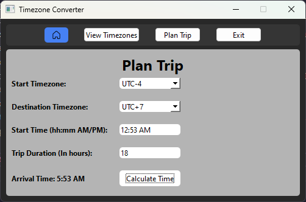

# EA1 - Timezone Converter

## 1. Package/Library

This program was created using the PyQt6 library in Python as its primary focus of exploration. It is used for creating GUIs within Python. I found that using this library was similar to using the JavaFX library for creating GUIs within Java, however I felt that the documentation and overall ease of usage was much better with PyQt6.

I also used Pendulum as a sort of secondary library, which is used for Date and Time related functions, as well as its built in timezone features (which is why I chose this library as a supplement).

## 2. How to run the program

- You must first make sure that you have Python3 installed.
- Install the two libraries using the following commands:

PyQt6:
pip install PyQt6
or (I had to use the second one)
python -m pip install PyQt6

Pendulum:
pip install pendulum
or
python -m pip install pendulum

- You must then clone the repository
git clone https://github.com/CS2613-WI24-FR01B/exploration-activity-1-TheCrabJesus.git

- Navigate to the directory that you cloned the file to
cd <location-you-clone-file>

- Run the program
python timezoneconverter.py

## 3. Program's Purpose

This program is used to be able to do timezone conversions. There are 3 tabs within the program, that can be navigated between using the toolbar at the top of the program:

1. Home
    - Simply displays the current local time and current local timezone

2. View Timezones
    - Used to select any timezone, and shows the current time in your timezone, as well as the current time in the selected timezone

3. Plan Trip
    - Here you can plan out what time you will be arriving in another timezone when taking longer trips. To use it, you must first select a starting timezone (usually this will be your current timezone, however it's possible that you're departing from somewhere else), next you select the timezone in which you will be arriving at, then you input the time you will be leaving (this is formatted as hh:mm AM/PM; ex: 4:24 PM) as well as the duration of your travel (in hours; ex: 4.5). Once all the information is input, pressing the Calculate Time button will return the time it will be once you arrive.
    - Note that currently inputting data in a wrong format, or not inputting data will result in the program to crash.

## 4. Sample Input/Output

Upon first opening the program, you are greeted with the Home window:

Clicking on the View Timezones button:

Changing the timezone in View Timezones:

Clicking on the Plan Trip button:

Example data of planning a trip:
